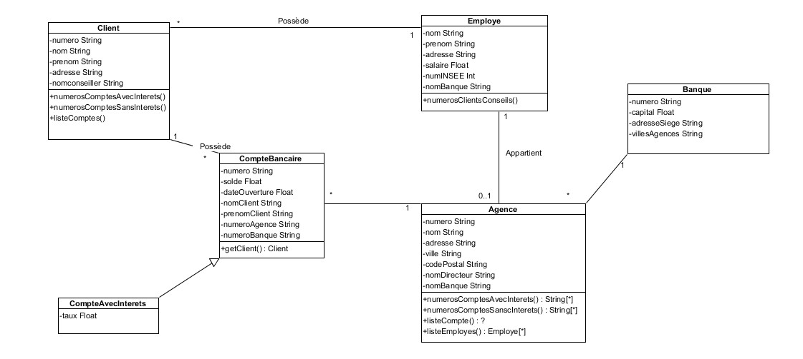

# IFRI : JAVA TP 2


## Etudiants

| Nom & Prénoms       | Filière |
|---------------------|---------|
| TIGA Abdoul-Wakilou | GL      |
| AYHI Judicael       | GL      |


## Consignes

	1. Etablissez les relations entre les tables.
	2. Ecrivez les classes « Entity » Java correspondants au diagramme UML
	3. Ecrivez les classes repository associées aux classes
	4. Ajoutez les méthodes JPA Repository permettant : 
		• de lister tous les clients d’une agence, 
		• de rechercher les clients par nom et prénom
		• De lister tous les clients d’une banque qui sont en découvert
	5. En utilisant les controllers Spring et les JSP, développez les écrans permettant :
		• de lister les clients d’une agence
		• D’enregistrer via un formulaire un nouveau client dans une agence
		• De lister tous les clients qui sont à découvert
	Vous utiliserez un framework comme Bootstrap pour un rendu UX convivial

## Diagramme




## Notes

### Create postgres database
```postgresql
-- Create a new user 'ifri' with a password
CREATE USER ifri WITH PASSWORD 'password';

-- Create a new database 'ifri_java_tp2'
CREATE DATABASE ifri_java_tp2;

-- Grant all privileges on the 'ifri_java_tp2' to the 'ifri' user
GRANT ALL PRIVILEGES ON DATABASE ifri_java_tp2 TO ifri;
```

